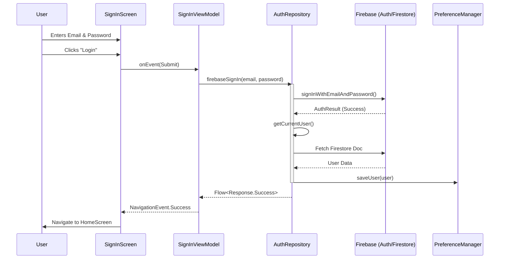
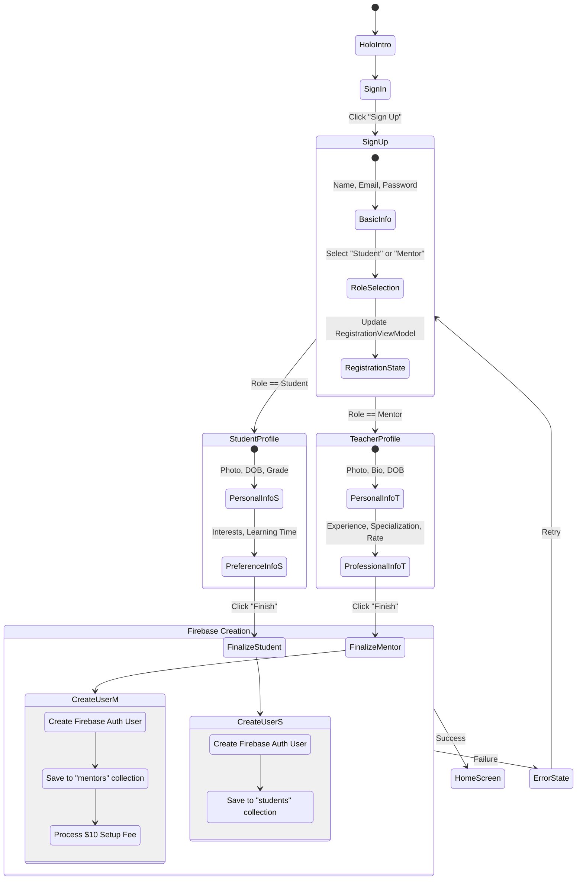

# HoloVerse Authentication Flow

This document provides a visual representation of the authentication and registration processes in
the HoloVerse application.

---

## 1. High-Level Flow (Visual Layout)

```text
       [ APP START ]
             |
      ( HoloIntroScreen )
             |
      [ SignInScreen ] <---------------------------+
             |                                     |
      { Is New User? } --- Yes ---> [ SignUpScreen ]
             |                         |           |
             No                        |     { User Type? }
             |                         |      /        \
      { Credentials? } <---------------+   Mentor    Student
       /      \                               |          |
    Error   Success                  [ Teacher Prof ] [ Student Prof ]
      |        |                              |          |
      +--------|                     [ Teacher Info ] [ Student Pref ]
               |                              |          |
        { Check Role }                ( Finalize & Pay) ( Finalize )
        /      |      \                       |          |
    Admin   Mentor   Student                  +----------+
      |        |        |                           |
[ Admin ]  [   HOME SCREEN   ] <--------------------+
```

---

## 2. Authentication Sequence

This diagram illustrates the interaction between the UI, ViewModels, Repositories, and Firebase
during a standard Sign-In process.



---

## 3. Multi-Step Signup Activity

The signup process is role-based and involves multiple steps to gather profile information before
final creation in Firebase.



---

## 🛠️ Troubleshooting: Missing "Preview" Button

If you don't see the **Split/Preview** icon in the top-right corner of your editor while viewing
this file:

1. **Enable Mermaid Support**:
    - Go to `File` > `Settings` > `Languages & Frameworks` > `Markdown`.
    - Scroll to **Markdown Extensions** and check **Mermaid**.
2. **Fix Missing Preview Pane**:
    - Press `Shift` twice and type **"Choose Boot Java Runtime"**.
    - Select a version that includes **"jcef"** in its name.
    - Restart Android Studio.
